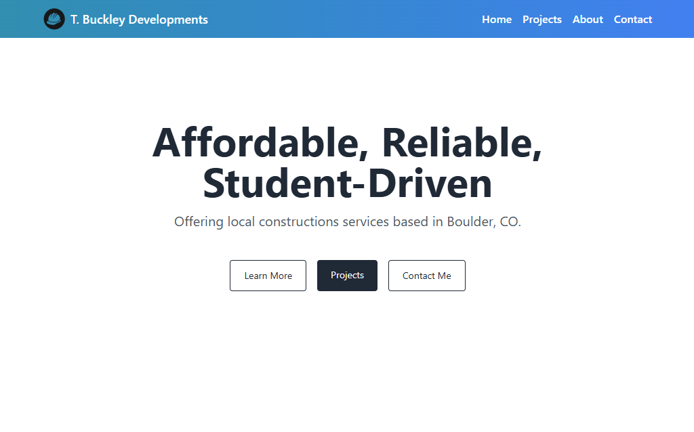

# T. Buckley Developments - Construction Website

Visit the live site: [tbuckdev.com](https://tbuckdev.com)

This project is a full-stack web application developed for my brother’s construction business. The content of the site (About, Contact, Projects) is specific to the business, while the development, structure, and deployment reflect my technical and creative work.

  

## Stack

- React (with Tailwind CSS)
- Node.js / Express
- MongoDB (via Mongoose)
- Nodemailer (contact form emails)
- Deployed with Render
- Domain configured via Namecheap

## Features

- Fully responsive and mobile-friendly design
- Multi-page layout with routing: Home, Projects, About, Contact
- Contact form with backend email handling via Nodemailer
- Projects stored and retrieved via MongoDB
- Backend API built with Express and served under `/api`
- Deployment-ready with environment-based configuration
- Custom domain and SSL certificate setup
- Clean and accessible design using Tailwind CSS utility classes

## Deployment
- Frontend and backend are deployed as separate services on Render
- Custom domain tbuckdev.com is configured via Namecheap
- Render automatically handles SSL certificates (HTTPS)
- Environment variables are configured securely via Render’s dashboard

## Credits
Connor Buckley
